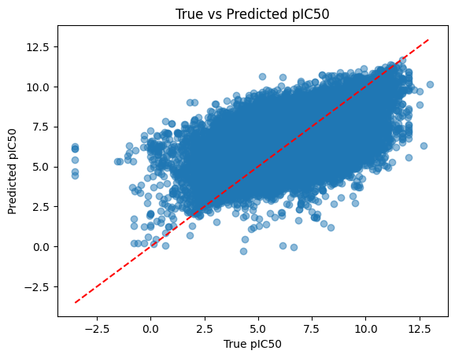
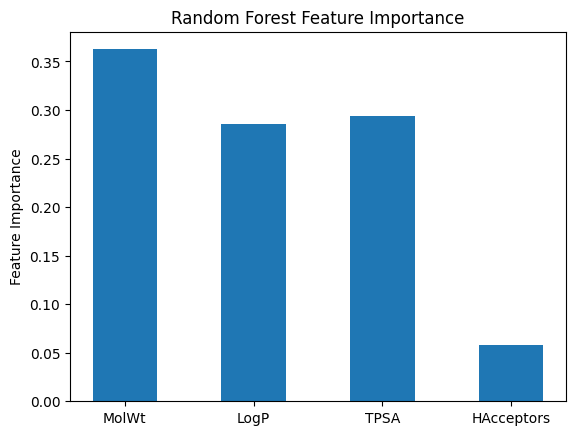

# Protein-Ligand-Binding-Predictor

本專案是一個以機器學習為基礎的蛋白質-小分子結合強度（pIC50）預測工具，結合了化學資訊學 (Chemoinformatics) 和資料科學技術，協助篩選藥物候選分子。

---

## 💡 專案動機

在藥物開發中，蛋白質與小分子的結合親和力（例如 IC50 或 pIC50）是篩選潛力分子的重要指標。本專案利用公開資料（BindingDB），抽取分子特徵並使用多種機器學習模型，快速預測結合強度，加速早期藥物設計流程。

---

## 🔬 方法流程

1️⃣ **資料前處理**  
- 從 BindingDB 匯入蛋白質-小分子結合資料  
- 過濾並清洗 IC50 欄位，轉換成 pIC50

2️⃣ **特徵工程**  
- 使用 RDKit 計算分子特徵，如分子量 (MolWt)、LogP、極性表面積 (TPSA)、氫鍵供體/受體數 (HDonors / HAcceptors)

3️⃣ **模型訓練與比較**  
- 隨機森林 (Random Forest)
- Gradient Boosting
- 線性回歸 (作為 baseline)

4️⃣ **特徵重要性分析**  
- 內建重要性 (Feature Importance)
- 刪除特徵影響 (R2 Drop)

5️⃣ **模型評估與可視化**

---

## ⚙️ 使用技術

- Python (pandas, numpy, matplotlib, scikit-learn)
- RDKit (分子特徵計算)

---

## 📊 結果示例

### ✅ 真實 vs 預測 pIC50 散點圖

> 點越接近紅線，代表模型預測越準確。

---

### ✅ 隨機森林特徵重要性

> 顯示各分子特徵對模型的重要性，MolWt 與 LogP 影響最大。

---

## 💬 特徵刪除分析

| Removed    | R2_after_removal | R2_drop |
|-------------|------------------|----------|
| MolWt     | 0.218             | **0.431** |
| LogP      | 0.378             | 0.272   |
| TPSA     | 0.650             | ~0     |
| HDonors | 0.679             | <0    |
| HAcceptors | 0.658         | ~0    |

> 刪除 MolWt 與 LogP 會讓模型表現大幅下降，顯示其關鍵性。

---

## 💪 後續計畫

- 加入更多分子描述符（如指紋特徵）
- 進一步優化模型參數（Grid Search、Bayesian Tuning）
- 實作線上預測 Demo（Streamlit 或 Gradio）

---

## 📄 資料來源

- [BindingDB](https://www.bindingdb.org/)

